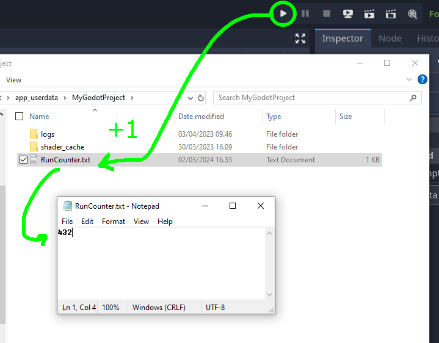

# Godot Run Counter

A simple Godot 4 addon that keeps track of how many times you run (or launch) your Godot project while developing it. 

## How can I see the counter? Where is it saved?
The counter is incremented and saved in a text file called `RunCounter.txt` in the game's [persistent user data](https://docs.godotengine.org/en/stable/tutorials/io/data_paths.html#accessing-persistent-user-data-user) folder (`user://`).

You can customize the destination and the file name in `RunCounter.gd`.

## Does it also count how many times the player launches the game?
No, it counts only when running from the editor.

## Installation

1. Clone or download the repository
2. Move the `addons/RunCounter` folder to the `addons` folder within your project directory (`res://addons/RunCounter`)
3. Enable the plugin from the `plugins` tab of the Godot editor project settings
